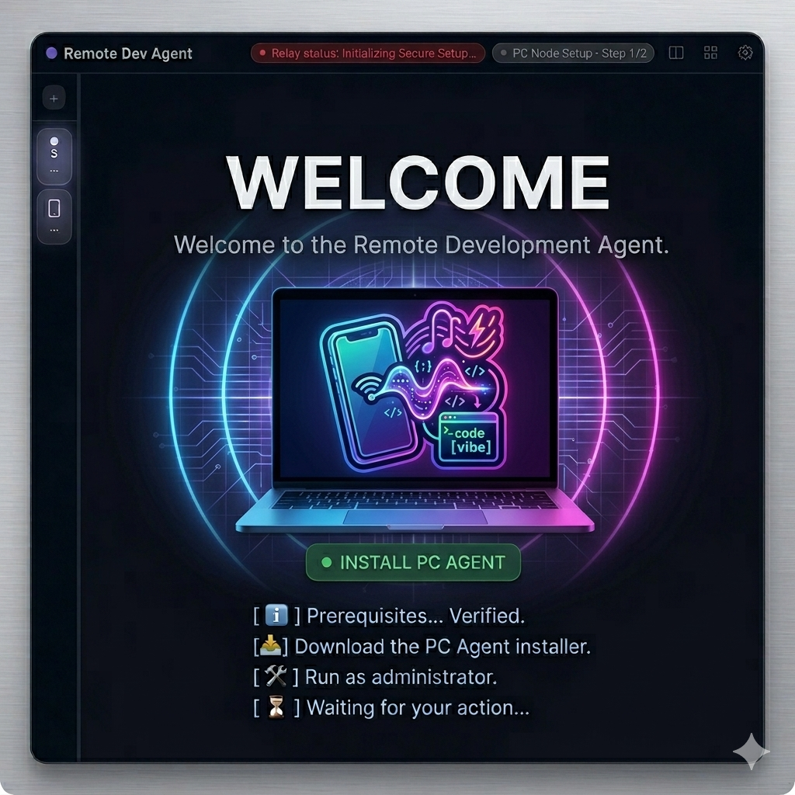
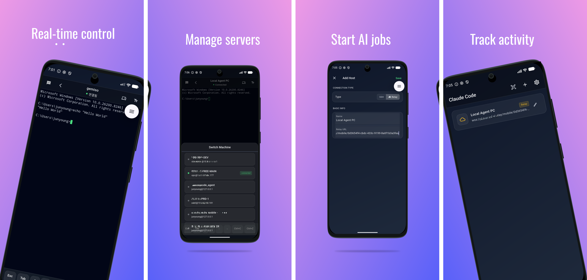
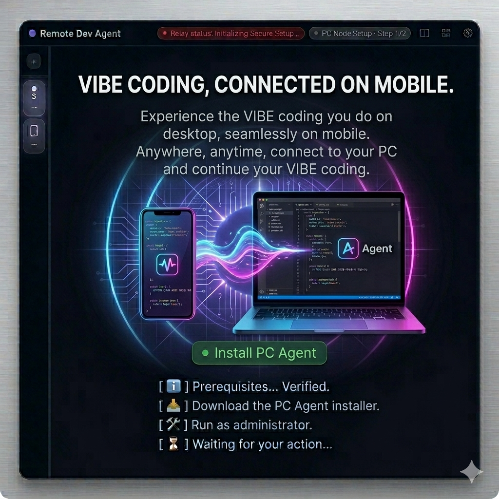
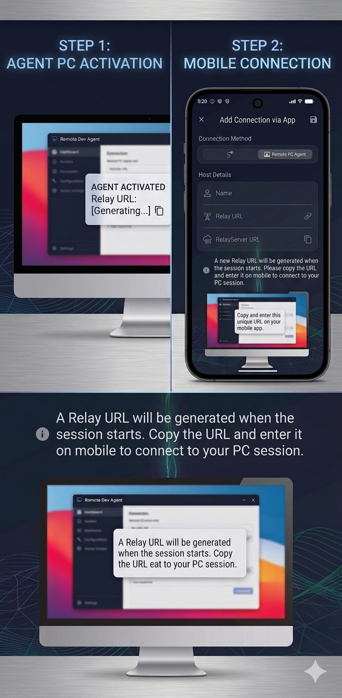

# 🚀 AI Remote Vibe Download Guide

AI Remote Vibe is distributed via GitHub Releases.  
Follow the steps below to download and install the app.

---

## 📥 1. Go to the Download Page

Click the link below to access the latest version:

👉 https://github.com/jun-young1993/ai_remote_vibe_agent_release/releases/latest

> This link always redirects to the latest release.

---

## 🖥️ 2. Download the App

  

1. Scroll down the page  
2. Find the **Assets** section  
3. Download the file for your OS  

- Windows → `.exe`  
- macOS → `.dmg`  
- Others → `.zip`  

---

## ▶️ 3. Run the App

After downloading:

1. Open the file  
2. Install or run directly  
3. Launch AI Remote Vibe 🎉  

---

## 📱 4. Mobile App Download

  

The mobile app is available on both platforms:

- iOS → App Store  
- Android → Play Store  

👉 You can download the iOS and Android apps from the Play Store and App Store.

---

## 🔗 5. Connect the App

  

- Create a session on the PC app  
- Connect from your mobile or another device  

---

## ⚡ 6. Activate Agent

  

- Activate the agent on the connected device  
- Enable real-time control and monitoring  

---

## 🛒 Store Availability

  

The mobile app can be downloaded from **Play Store and App Store for both iOS and Android devices**.

---

## ⚠️ Installation Notes (Windows)

The Windows version is **not code-signed yet**, so you may see a security warning.

### 🔐 How to bypass Windows SmartScreen

1. When the warning appears: *"Windows protected your PC"*  
2. Click **More info**  
3. Click **Run anyway**  

> This is a common warning for unsigned apps and does not necessarily indicate a security issue.

---

## 💡 Notes

- The app is officially distributed via GitHub Releases  
- It is recommended to always use the latest version  

---

## 📌 App Info

- App Name: **AI Remote Vibe**  
- Distribution: GitHub Releases  
- Platforms: Windows / macOS / iOS / Android  

---
